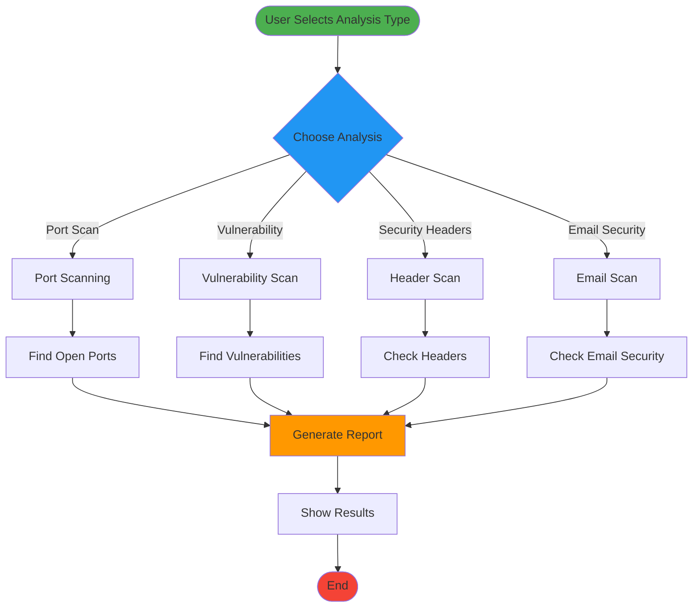
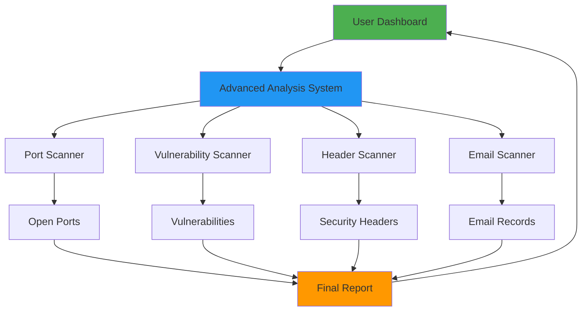
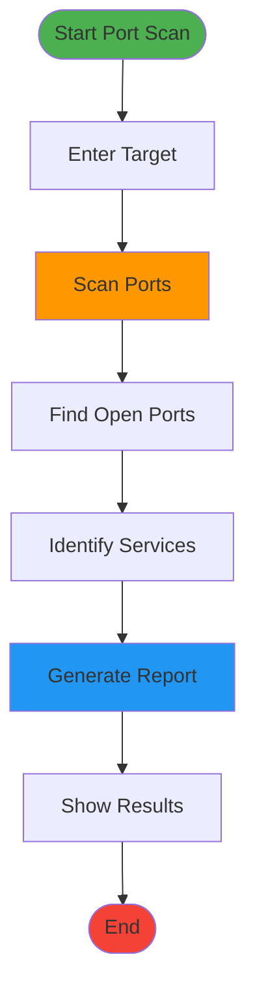
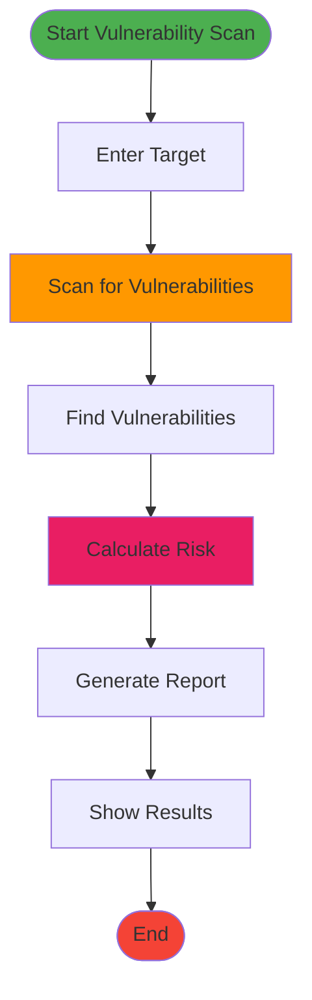

# Advanced Analysis - Mermaid Diagram

Simple overview diagram for Advanced Security Analysis features (Port Scanning, Vulnerability Assessment, etc.).

## Advanced Analysis Overview

## Advanced Analysis Components

## Port Scanning Workflow

## Vulnerability Assessment Workflow

