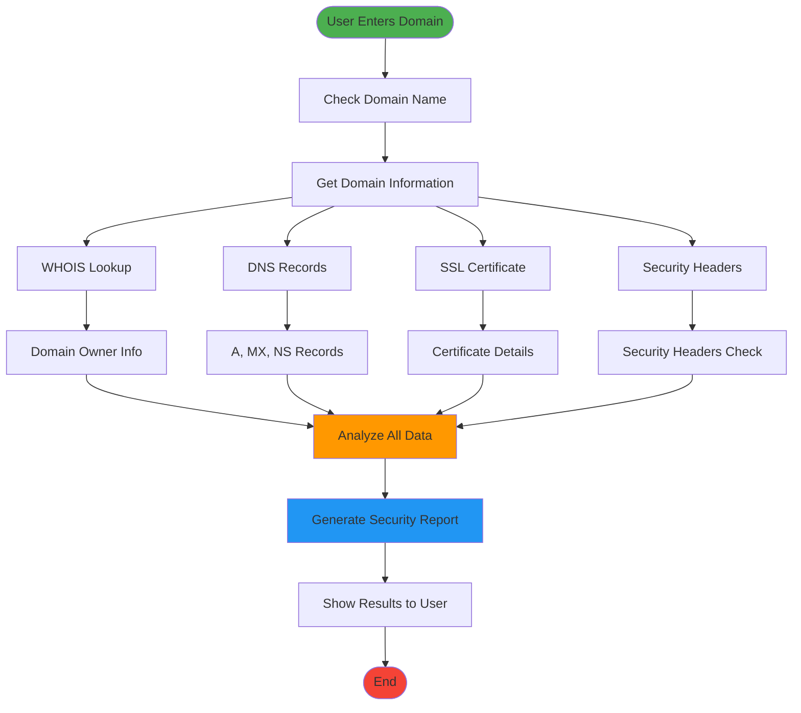
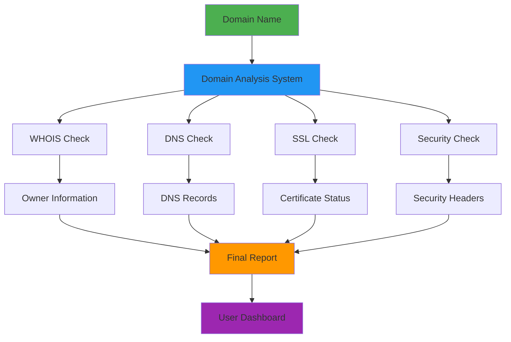

# Domain Analysis - Mermaid Diagram

Simple overview diagram for Domain Security Analysis feature.

## Domain Analysis Workflow

```mermaid
flowchart TD
    Start([User Enters Domain]) --> CheckDomain[Check Domain Name]
    CheckDomain --> GetInfo[Get Domain Information]
    
    GetInfo --> WHOIS[WHOIS Lookup]
    GetInfo --> DNS[DNS Records]
    GetInfo --> SSL[SSL Certificate]
    GetInfo --> Security[Security Headers]
    
    WHOIS --> Owner[Domain Owner Info]
    DNS --> Records[A, MX, NS Records]
    SSL --> Cert[Certificate Details]
    Security --> Headers[Security Headers Check]
    
    Owner --> Analyze[Analyze All Data]
    Records --> Analyze
    Cert --> Analyze
    Headers --> Analyze
    
    Analyze --> Report[Generate Security Report]
    Report --> Show[Show Results to User]
    Show --> End([End])
    
    style Start fill:#4caf50
    style End fill:#f44336
    style Analyze fill:#ff9800
    style Report fill:#2196f3
```

## Domain Analysis Components

```mermaid
graph TB
    Domain[Domain Name] --> System[Domain Analysis System]
    
    System --> WHOIS[WHOIS Check]
    System --> DNS[DNS Check]
    System --> SSL[SSL Check]
    System --> Security[Security Check]
    
    WHOIS --> Owner[Owner Information]
    DNS --> Records[DNS Records]
    SSL --> Certificate[Certificate Status]
    Security --> Headers[Security Headers]
    
    Owner --> Result[Final Report]
    Records --> Result
    Certificate --> Result
    Headers --> Result
    
    Result --> User[User Dashboard]
    
    style Domain fill:#4caf50
    style System fill:#2196f3
    style Result fill:#ff9800
    style User fill:#9c27b0
```
