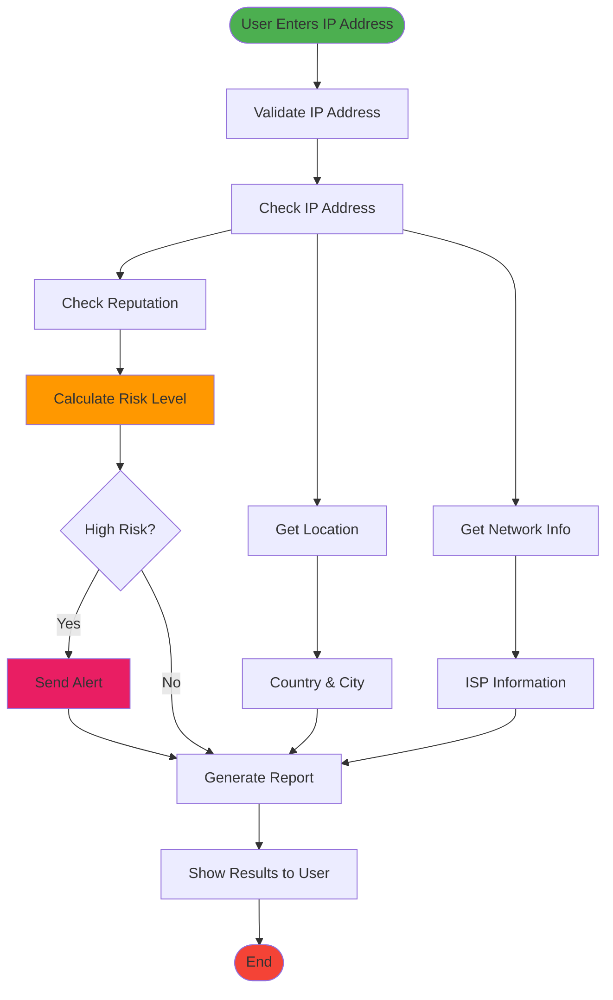
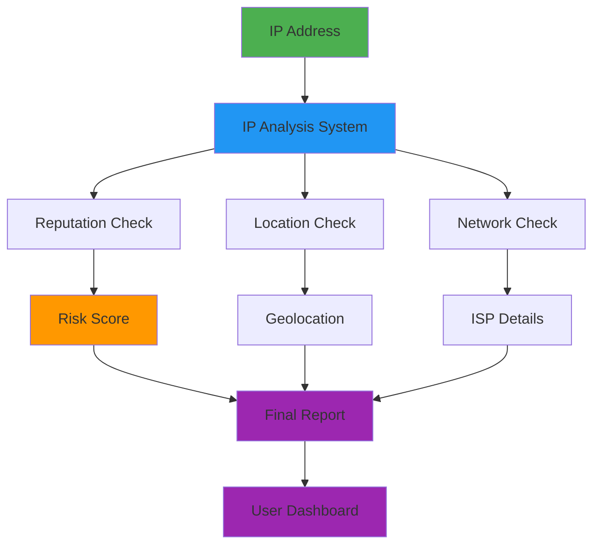

# IP Analysis - Mermaid Diagram

Simple overview diagram for IP Reputation Analysis feature.

## IP Analysis Workflow

```mermaid
flowchart TD
    Start([User Enters IP Address]) --> Validate[Validate IP Address]
    Validate --> CheckIP[Check IP Address]
    
    CheckIP --> Reputation[Check Reputation]
    CheckIP --> Location[Get Location]
    CheckIP --> Network[Get Network Info]
    
    Reputation --> Risk[Calculate Risk Level]
    Location --> Country[Country & City]
    Network --> ISP[ISP Information]
    
    Risk --> High{High Risk?}
    High -->|Yes| Alert[Send Alert]
    High -->|No| Report[Generate Report]
    
    Country --> Report
    ISP --> Report
    Alert --> Report
    
    Report --> Show[Show Results to User]
    Show --> End([End])
    
    style Start fill:#4caf50
    style End fill:#f44336
    style Risk fill:#ff9800
    style Alert fill:#e91e63
```

## IP Analysis Components

```mermaid
graph TB
    IP[IP Address] --> System[IP Analysis System]
    
    System --> Reputation[Reputation Check]
    System --> Location[Location Check]
    System --> Network[Network Check]
    
    Reputation --> Risk[Risk Score]
    Location --> Geo[Geolocation]
    Network --> ISP[ISP Details]
    
    Risk --> Result[Final Report]
    Geo --> Result
    ISP --> Result
    
    Result --> User[User Dashboard]
    
    style IP fill:#4caf50
    style System fill:#2196f3
    style Risk fill:#ff9800
    style Result fill:#9c27b0
    style User fill:#9c27b0
```
