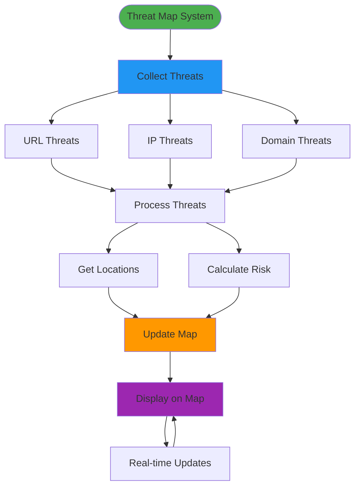
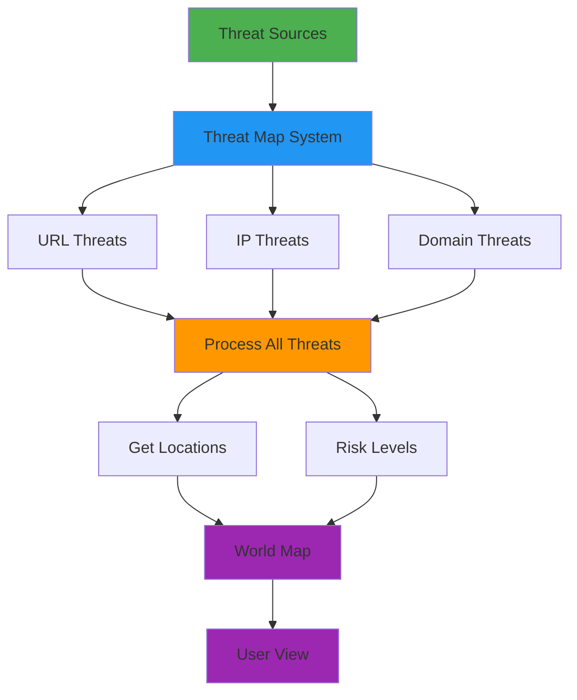
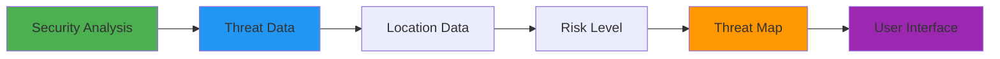

# Live Threat Map - Mermaid Diagram

Simple overview diagram for Live Threat Map feature.

## Live Threat Map Overview

```mermaid
flowchart TD
    Start([Threat Map System]) --> Collect[Collect Threats]
    
    Collect --> URL[URL Threats]
    Collect --> IP[IP Threats]
    Collect --> Domain[Domain Threats]
    
    URL --> Process[Process Threats]
    IP --> Process
    Domain --> Process
    
    Process --> Location[Get Locations]
    Process --> Risk[Calculate Risk]
    
    Location --> Map[Update Map]
    Risk --> Map
    
    Map --> Display[Display on Map]
    Display --> Update[Real-time Updates]
    Update --> Display
    
    style Start fill:#4caf50
    style Collect fill:#2196f3
    style Map fill:#ff9800
    style Display fill:#9c27b0
```

## Threat Map Components

```mermaid
graph TB
    Threats[Threat Sources] --> System[Threat Map System]
    
    System --> URL[URL Threats]
    System --> IP[IP Threats]
    System --> Domain[Domain Threats]
    
    URL --> Process[Process All Threats]
    IP --> Process
    Domain --> Process
    
    Process --> Location[Get Locations]
    Process --> Risk[Risk Levels]
    
    Location --> Map[World Map]
    Risk --> Map
    
    Map --> User[User View]
    
    style Threats fill:#4caf50
    style System fill:#2196f3
    style Process fill:#ff9800
    style Map fill:#9c27b0
    style User fill:#9c27b0
```

## Threat Map Data Flow

```mermaid
flowchart LR
    Analysis[Security Analysis] --> Threats[Threat Data]
    Threats --> Location[Location Data]
    Location --> Risk[Risk Level]
    Risk --> Map[Threat Map]
    Map --> User[User Interface]
    
    style Analysis fill:#4caf50
    style Threats fill:#2196f3
    style Map fill:#ff9800
    style User fill:#9c27b0
```
