# CyberRegis Platform - Mermaid Diagrams

This file contains Mermaid diagram code for all essential features of the CyberRegis platform. Copy and paste each diagram into Mermaid UI (https://mermaid.live/) to generate images.

---

## 1. System Architecture Diagram

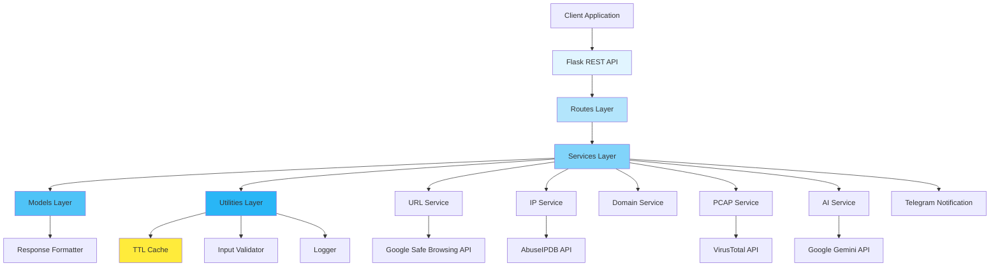

---

## 2. URL Security Analysis Flow

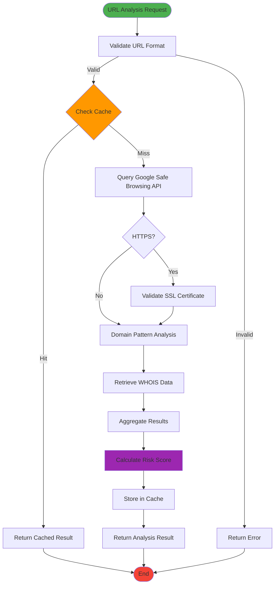

---

## 3. IP Reputation Analysis Flow

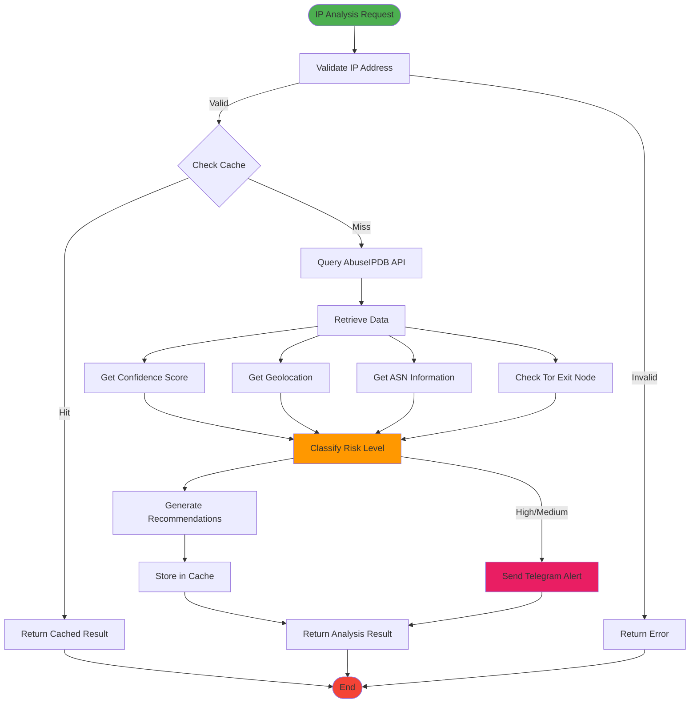

---

## 4. Domain Security Analysis Flow

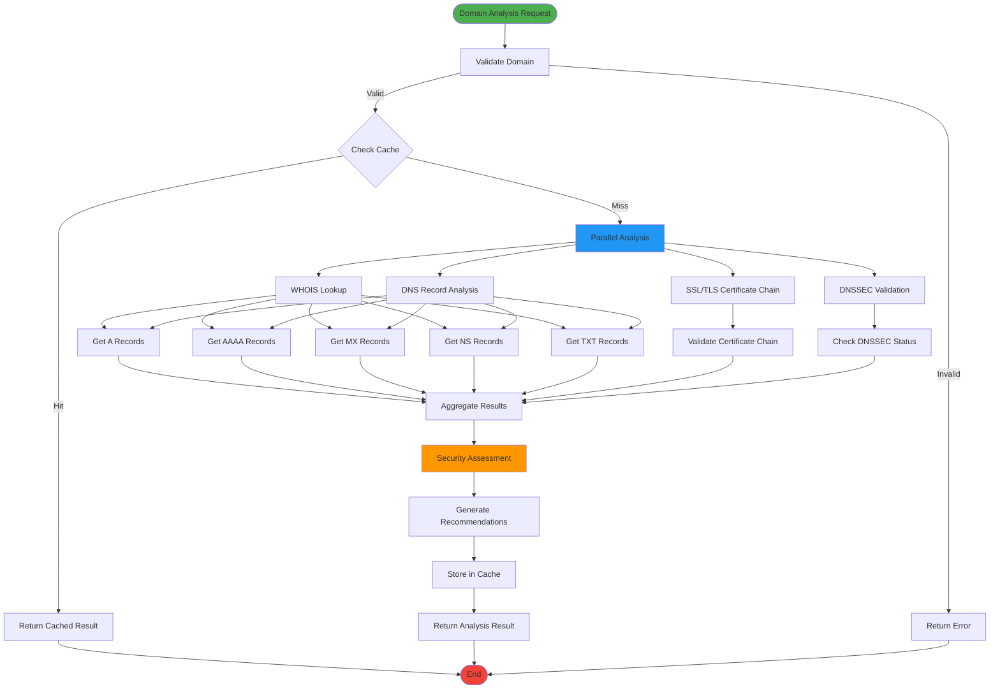

---

## 5. Network Packet Analysis Flow

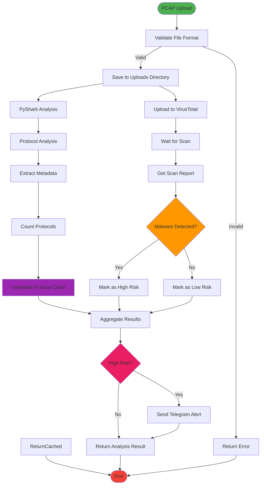

---

## 6. Security Scanning Workflow

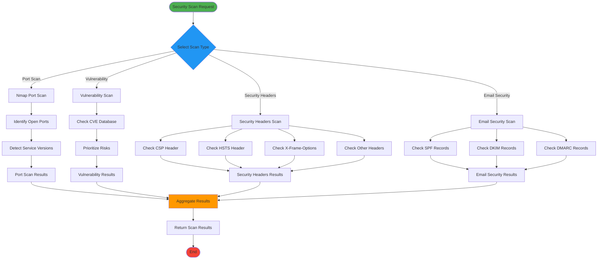

---

## 7. AI-Powered Consultation Flow

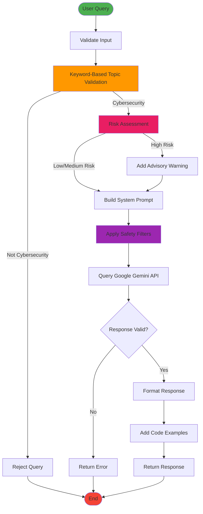

---

## 8. Caching Strategy Flow

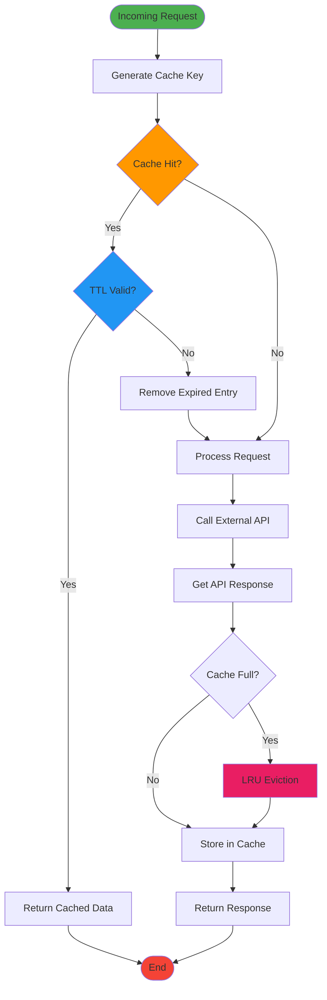

---

## 9. Notification System Flow

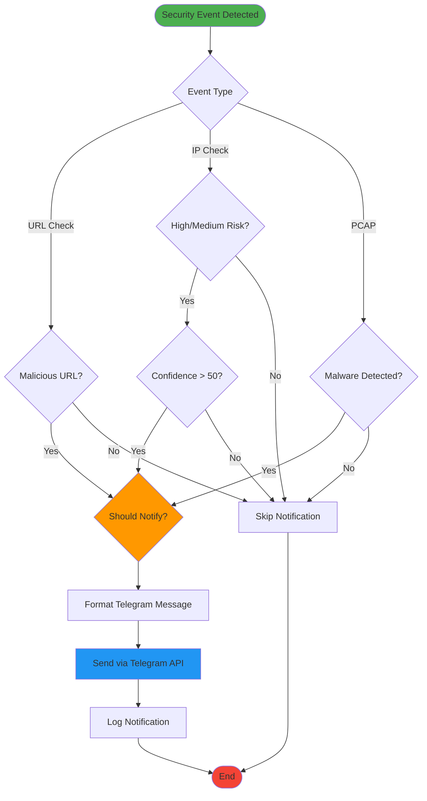

---

## 10. Overall Request Processing Flow

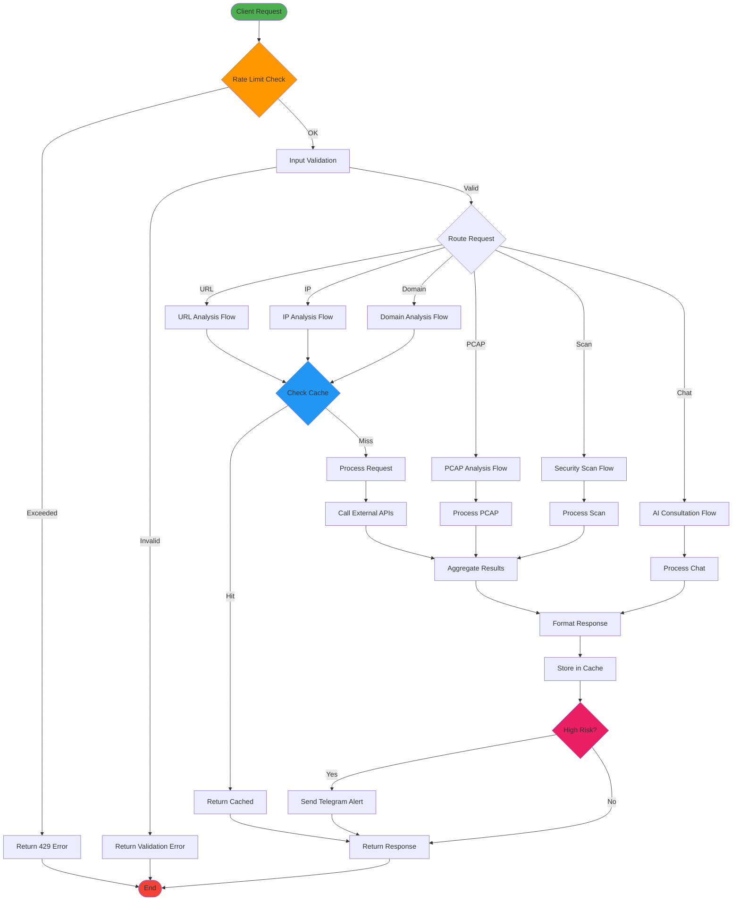

---

## 11. System Component Interaction Diagram

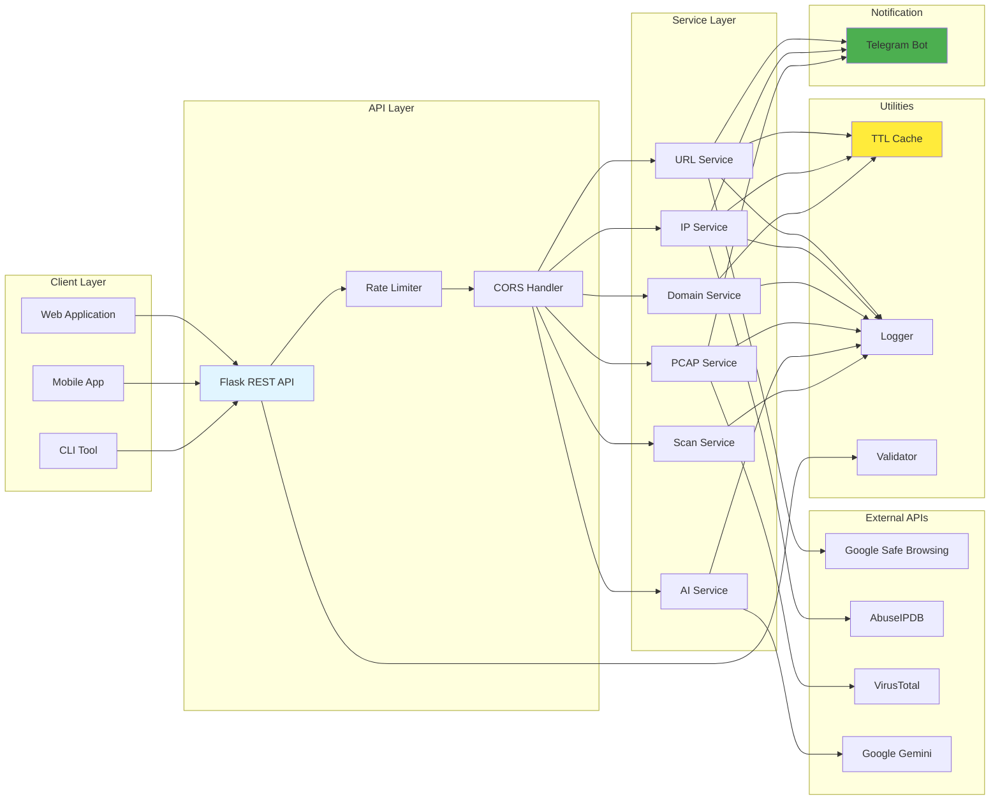

---

## Usage Instructions

1. Copy any diagram code block (between the ```mermaid markers)
2. Go to https://mermaid.live/ or use any Mermaid-compatible tool
3. Paste the code into the editor
4. Export as PNG, SVG, or PDF
5. Use the exported images in your LaTeX document

---

## Notes

- All diagrams use standard Mermaid syntax
- Colors are applied for better visualization
- Each diagram can be customized by modifying the style attributes
- For LaTeX, PNG format at 300 DPI is recommended
- SVG format provides better scalability for vector graphics
