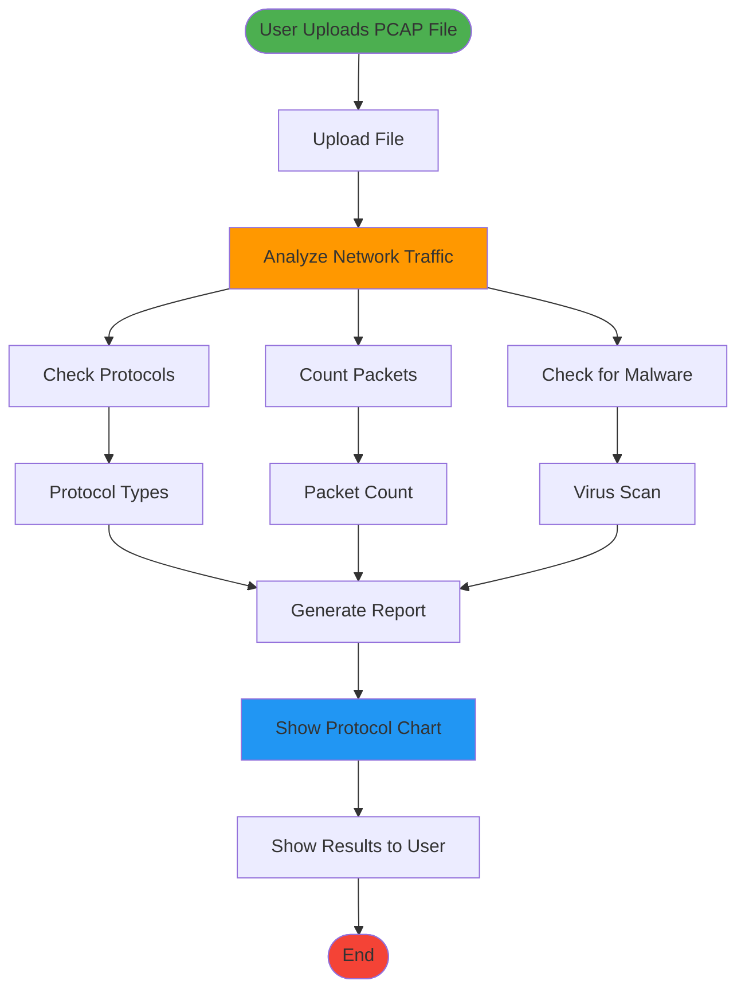
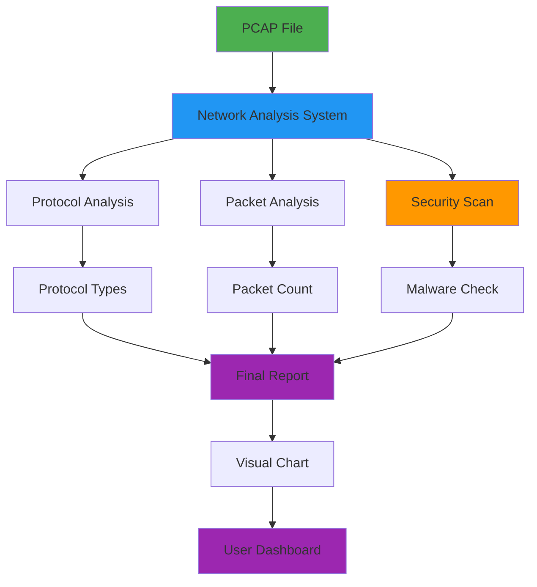

# Network Analysis - Mermaid Diagram

Simple overview diagram for Network Packet Analysis (PCAP) feature.

## Network Analysis Workflow

```mermaid
flowchart TD
    Start([User Uploads PCAP File]) --> Upload[Upload File]
    Upload --> Analyze[Analyze Network Traffic]
    
    Analyze --> Protocols[Check Protocols]
    Analyze --> Packets[Count Packets]
    Analyze --> Malware[Check for Malware]
    
    Protocols --> Types[Protocol Types]
    Packets --> Count[Packet Count]
    Malware --> Scan[Virus Scan]
    
    Types --> Report[Generate Report]
    Count --> Report
    Scan --> Report
    
    Report --> Chart[Show Protocol Chart]
    Chart --> Show[Show Results to User]
    Show --> End([End])
    
    style Start fill:#4caf50
    style End fill:#f44336
    style Analyze fill:#ff9800
    style Chart fill:#2196f3
```

## Network Analysis Components

```mermaid
graph TB
    PCAP[PCAP File] --> System[Network Analysis System]
    
    System --> Protocol[Protocol Analysis]
    System --> Packet[Packet Analysis]
    System --> Security[Security Scan]
    
    Protocol --> Types[Protocol Types]
    Packet --> Count[Packet Count]
    Security --> Malware[Malware Check]
    
    Types --> Result[Final Report]
    Count --> Result
    Malware --> Result
    
    Result --> Chart[Visual Chart]
    Chart --> User[User Dashboard]
    
    style PCAP fill:#4caf50
    style System fill:#2196f3
    style Security fill:#ff9800
    style Result fill:#9c27b0
    style User fill:#9c27b0
```
